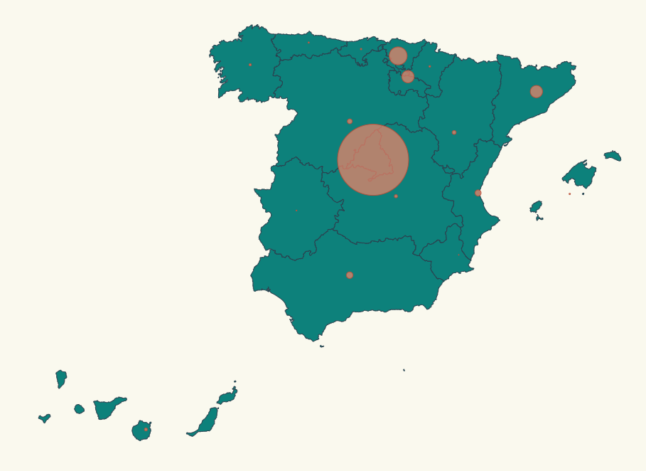
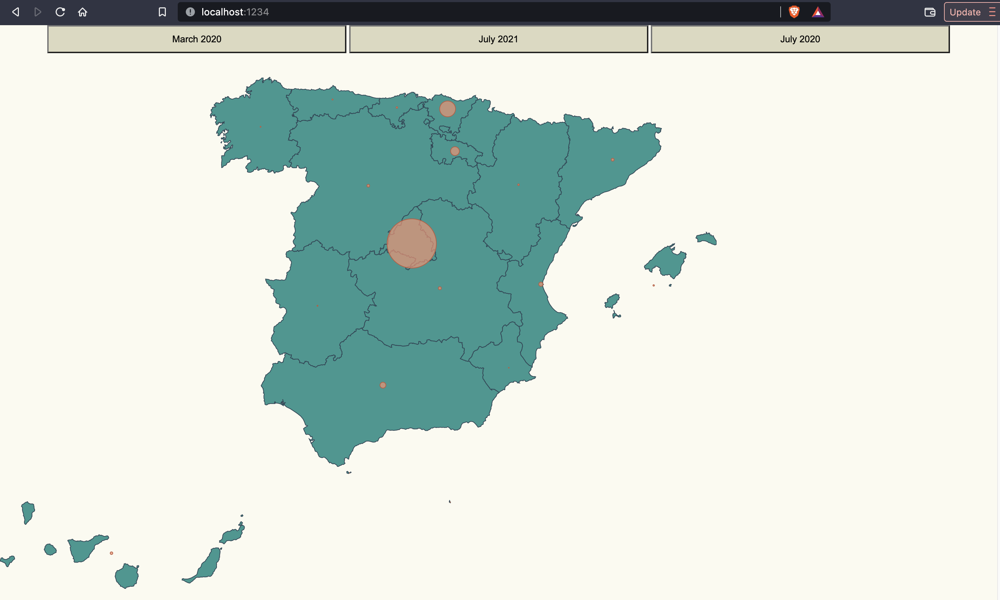

# COVID-19 in Spain (by Region): Pinning locations + scale

Our boss liked a lot the map we have developed, now he wants to focus on Spain affection by Region (Comunidad Autónoma), he wants to display a map pinning affected locations and scaling that pin according the number of cases affected by Covid-19, something like:



We have to face three challenges here:

- Place pins on a map based on location.
- Scale pin radius based on affected number.
- Add a buttons to compare the data with the previous data.

# Steps

- We will take as starting example _02-pin-location-scale_, let's copy the content from that folder and execute:

```bash
npm install

npm install topojson-client --save

npm install @types/topojson-client --save-dev

npm install d3-composite-projections --save

npm install @types/node --save-dev

npm start
```

# stats.ts

- We will use 3 dataset: March 2020, July 2021 and July 2022. So we will update out stats.ts file

_./src/stats.ts_

```diff
+export interface ResultsEntry {
+  name: string;
+  value: number;}

-export const stats = [
+export const march2020data: ResultsEntry[] = [
  {
    name: "Madrid",
-    value: 174,
+    value: 469,
  },
  {
    name: "La Rioja",
-    value: 39,
+    value: 81,
  },
  {
    name: "Andalucía",
-    value: 34,
+    value: 54,
  },
  {
    name: "Cataluña",
    value: 24,
  },
  {
    name: "Valencia",
    value: 30,
+    value: 37,
  },
  {
    name: "Murcia",
-    value: 0,
+    value: 4,
  },
  {
    name: "Extremadura",
-    value: 6,
+    value: 7,
  },
  {
    name: "Castilla La Mancha",
-    value: 16,
+    value: 26,
  },
  {
    name: "País Vasco",
-    value: 45,
+    value: 149,
  },
  {
    name: "Cantabria",
-    value: 10,
+    value: 12,
  },
  {
    name: "Asturias",
-    value: 5,
+    value: 7,
  },
  {
    name: "Galicia",
-    value: 3,
+    value: 6,
  },
  {
    name: "Aragón",
-    value: 11,
+    value: 13,
  },
  {
    name: "Castilla y León",
-    value: 19,
+    value: 23,
  },
  {
    name: "Islas Canarias",
-    value: 18,
+    value: 22,
  },
  {
    name: "Islas Baleares",
-    value: 6,
+    value: 11,
  },
+  {
+    name: "Ceuta",
+    value: 0,
+  },
+  {
+    name: "Melilla",
+    value: 0,
+  },
];
+/*
+Total Covid-19 cases accumulated by Region in Spain (July 22nd 2021).
+Data from:  https://www.sanidad.gob.es/profesionales/saludPublica/ccayes/alertasActual/nCov/documentos/Actualizacion_425_COVID-19.pdf
+*/
+export const july2021data: ResultsEntry[] = [
+  {
+    name: "Madrid",
+    value: 788287,
+  },
+  {
+    name: "La Rioja",
+    value: 34545,
+  },
+  {
+    name: "Andalucía",
+    value: 678572,
+  },
+  {
+    name: "Cataluña",
+    value: 798594,
+  },
+  {
+    name: "Valencia",
+    value: 446063,
+  },
+  {
+    name: "Murcia",
+    value: 122297,
+  },
+  {
+    name: "Extremadura",
+    value: 85064,
+  },
+  {
+    name: "Castilla La Mancha",
+    value: 205223,
+  },
+  {
+    name: "País Vasco",
+    value: 223321,
+  },
+  {
+    name: "Cantabria",
+    value: 37586,
+  },
+  {
+    name: "Asturias",
+    value: 63764,
+  },
+  {
+    name: "Galicia",
+    value: 149190,
+  },
+  {
+    name: "Aragón",
+    value: 141987,
+  },
+  {
+    name: "Castilla y León",
+    value: 268532,
+  },
+  {
+    name: "Islas Canarias",
+    value: 73495,
+  },
+  {
+    name: "Islas Baleares",
+    value: 75138,
+  },
+  {
+    name: "Navarra",
+    value: 73039,
+  },
+  {
+    name: "Ceuta",
+    value: 6191,
+  },
+  {
+    name: "Melilla",
+    value: 9541,
+  },
+];
+/*
+Total Covid-19 cases accumulated by Region in Spain (July 23rd 2022).
+Data from:  https://www.sanidad.gob.es/en/profesionales/saludPublica/ccayes/alertasActual/nCov/documentos/Actualizacion_618_COVID-19.pdf
+*/
+export const july2022data: ResultsEntry[] = [
+  {
+    name: "Madrid",
+    value: 1893443,
+  },
+  {
+    name: "La Rioja",
+    value: 107173,
+  },
+  {
+    name: "Andalucía",
+    value: 1560568,
+  },
+  {
+    name: "Cataluña",
+    value: 2602871,
+  },
+  {
+    name: "Valencia",
+    value: 1518781 ,
+  },
+  {
+    name: "Murcia",
+    value: 447426,
+  },
+  {
+    name: "Extremadura",
+    value: 295788 ,
+  },
+  {
+    name: "Castilla La Mancha",
+    value: 572671,
+  },
+  {
+    name: "País Vasco",
+    value: 760629 ,
+  },
+  {
+    name: "Cantabria",
+    value: 155198,
+  },
+  {
+    name: "Asturias",
+    value: 251812,
+  },
+  {
+    name: "Galicia",
+    value: 716013,
+  },
+  {
+    name: "Aragón",
+    value: 451063,
+  },
+  {
+    name: "Castilla y León",
+    value: 803641,
+  },
+  {
+    name: "Islas Canarias",
+    value: 429967,
+  },
+  {
+    name: "Islas Baleares",
+    value: 304432,
+  },
+  {
+    name: "Navarra",
+    value: 285575,
+  },
+  {
+    name: "Ceuta",
+    value: 23811,
+  },
+  {
+    name: "Melilla",
+    value: 24001,
+  },
+];
```

# Communities.ts

- Now we want to display a circle in the middle of each region (comunidad autónoma). We have seen that some of them are not being shown (Ceuta and Melilla), so we will add them. And also, we will move some of these "middles" ()

_./src/communities.ts_

```diff
export const latLongCommunities = [
  {
    name: "Madrid",
    long: -3.70256,
    lat: 40.4165,
  },
  {
    name: "Andalucía",
    long: -4.5,
    lat: 37.6,
  },
  {
    name: "Valencia",
    long: -0.37739,
    lat: 39.45975,
  },
  {
    name: "Murcia",
-    long: -1.13004,
+    long: -1.35,
-    lat: 37.98704,
+    lat: 37.8500,
  },
  {
    name: "Extremadura",
    long: -6.16667,
    lat: 39.16667,
  },
  {
    name: "Cataluña",
    long: 1.86768,
    lat: 41.82046,
  },
  {
    name: "País Vasco",
-    long: -2.75,
+    long: -2.60,
-    lat: 43.0,
+    lat: 43.14,
  },
  {
    name: "Cantabria",
    long: -4.03333,
    lat: 43.2,
  },
  {
    name: "Asturias",
    long: -5.86112,
    lat: 43.36662,
  },
  {
    name: "Galicia",
    long: -7.86621,
    lat: 42.75508,
  },
  {
    name: "Aragón",
-    long: -1.0,
+    long: -0.76,
-    lat: 41.0,
+    lat: 41.5,
  },
  {
    name: "Castilla y León",
-    long: -4.45,
+    long: -4.85,
-    lat: 41.383333,
+    lat: 41.60,
  },
  {
    name: "Castilla La Mancha",
    long: -3.000033,
    lat: 39.500011,
  },
  {
    name: "Islas Canarias",
-    long: -15.5,
+    long: -16.0,
-    lat: 28.0,
+    lat: 28.30,
  },
  {
    name: "Islas Baleares",
    long: 2.52136,
    lat: 39.18969,
  },
  {
    name: "Navarra",
    long: -1.65,
-    lat: 42.816666,
+    lat: 42.72,
  },
  {
    name: "La Rioja",
    long: -2.445556,
-    lat: 42.465,
+    lat: 42.265,
  },
+  {
+    name: "Ceuta",
+    long: -5.3162,
+    lat: 35.8883,
+  },
+  {
+    name: "Melilla",
+    long: -2.93848,
+    lat: 35.2919,
+  },
];
```

# index.ts

- Now we are going to set our index.ts to take the new datasets.

_./src/index.ts_

```diff
import * as d3 from "d3";
import * as topojson from "topojson-client";
const spainjson = require("./spain.json");
const d3Composite = require("d3-composite-projections");
-import { stats } from "./stats";
+import { march2020data, july2021data, july2022data, ResultsEntry } from "./stats";
import { latLongCommunities } from "./communities";
```

- Let's create a constructor to calculate the maximum number of affected of all communities of a given dataset:

_./src/index.ts_

```diff
-const maxAffected = stats.reduce(
+const calculateMaxAffected = (dataset: ResultsEntry[]) => {
+  return dataset.reduce(
  (max, item) => (item.value > max ? item.value : max),
  0
);
```
- Delete the Affected color scale
_./src/index.ts_

```diff
-const color = d3
-  .scaleThreshold<number, string>()
-  .domain([0, 1, 100, 500, 700, 5000])
-  .range([
-    "#FFFFF",
-    "#FFE8E5",
-    "#F88F70",
-    "#CD6A4E",
-    "#A4472D",
-    "#7B240E",
-    "#540000",
-  ]);
```
- Let's change our scale to map affected to radius size.

_./src/index.ts_

```diff
-const affectedRadiusScale = d3
+const calculateAffectedRadiusScale =  (maxAffected: number) => {
-  .scaleLinear()
-  .domain([0, maxAffected])
-  .range([0, 50]); // 50 pixel max radius, we could calculate it relative to width and height
+  return d3.scaleLinear().domain([0, maxAffected]).range([0, 35]);
};
```

- Let's update the helper function to glue the region name with the affected cases.

_./src/index.ts_

```diff
-const calculateRadiusBasedOnAffectedCases = (comunidad: string) => {
+const calculateRadiusBasedOnAffectedCases = (comunidad: string, dataset: ResultsEntry[]) => {
-  const entry = stats.find((item) => item.name === comunidad);
+  const maxAffected = calculateMaxAffected(dataset);
+  const affectedRadiusScale = calculateAffectedRadiusScale(maxAffected);
+  const entry = dataset.find((item) => item.name === comunidad);
+  const adder = d3
+    .scaleThreshold<number, number>()
+    .domain([50000, 100000, 500000, 1000000, 5000000])
+    .range([0.2, 0.4, 2, 4, 20]);  

-  return entry ? affectedRadiusScale(entry.value) : 0;
+  return entry ? affectedRadiusScale(entry.value) + adder(maxAffected) : 0;
};
```

- Let's tie it up with the circle rendering code that we created above for the initial data (march):

_./src/index.ts_

```diff
svg
  .selectAll("circle")
  .data(latLongCommunities)
  .enter()
  .append("circle")
  .attr("class", "affected-marker")
-  .attr("r", d => calculateRadiusBasedOnAffectedCases(d.name))
  .attr("cx", d => aProjection([d.long, d.lat])[0])
  .attr("cy", d => aProjection([d.long, d.lat])[1])
+  .attr("r", (d) => calculateRadiusBasedOnAffectedCases(d.name, march2020data));
```
- Now, we will add a function to update the chart, with a transition of 1000ms:

_./src/index.ts_

```typescript
const updateChart = (dataset: ResultsEntry[]) => {
  svg
    .selectAll("circle")
    .data(latLongCommunities)
    .attr("class", "affected-marker")
    .attr("cx", (d) => aProjection([d.long, d.lat])[0])
    .attr("cy", (d) => aProjection([d.long, d.lat])[1])
    .transition()
    .duration(1000)
    .attr("r", (d) => calculateRadiusBasedOnAffectedCases(d.name, dataset));
};
```
- We will implement now the events for each of these updates. We will add 3 documents, one for each dataset we added before (March 2020, July 2021 and July 2022):

_./src/index.ts_

```typescript
document
.getElementById("march2020")
.addEventListener("click", function handleInitialStats() {
  updateChart(march2020data);
});

document
.getElementById("july2021")
.addEventListener("click", function handleFinalStats() {
  updateChart(july2021data);
});

document
.getElementById("july2022")
.addEventListener("click", function handleFinalStats() {
  updateChart(july2022data);
});
```

- Let's create a canvasSize to use their parameters:

_./src/index.ts_

```typescript
const canvasSize = {width:1024, height:800};
```

_./src/index.ts_

```diff
const aProjection = d3Composite
  .geoConicConformalSpain()
+  .scale(3300)
+  .translate([625, 400]);
```

_./src/index.ts_

```typescript
aProjection.fitSize([canvasSize.width, canvasSize.height], geojson);
```

- Let's use these canvasSize parameters

_./src/index.ts_

```diff
const svg = d3
  .select("body")
  .append("svg")
-  .attr("width", 1024)
+  .attr("width", canvasSize.width)
-  .attr("height", 800)
+  .attr("width", canvasSize.height)
  .attr("style", "background-color: #FBFAF0");
```

# Map.css

- For the Spanish map we will slightly change the color and for the circles we will use a red-orange background and add some transparency to let the user see the spot and the spanish map under that spot.

_./src/map.css_

```diff
.country {
  stroke-width: 1;
  stroke: #2f4858;
-  fill: #008c86;
+  fill: #008c85e3
}

 .affected-marker {
  stroke-width: 1;
  stroke: #bc5b40;
  fill: #f88f70;
  fill-opacity: 0.7;
 }
```


# base.css

- We will set the same color for the whole background. Due to a prettier visualization

_./src/base.css_

```diff
body {
-  background: none repeat scroll 0% 0% rgb(255, 255, 255);
+  background: none repeat scroll 0% 0% #FBFAF0;
  font: 400 100%/1.625 "Open Sans", "Helvetica Neue", Helvetica, Arial,
    sans-serif;
  font-size: 13px;
  color: #3b3b3b;
}
```

- We will fix some mistakes:

_./src/base.css_

```diff
ul.left {
+  text-align: left;
}
```

- And add a class for customizing our buttons style (sizes and color):

_./src/base.css_

```typescript
.buttonStyle{
  height: 40px;
  width: 30%;
  background-color: #dcd9bf;
}
```

# index.html

- We will update our body style and button parameters, including the class we've just created for them.

_./src/index.html_

```diff
<html>
  <head>
    <link rel="stylesheet" type="text/css" href="./map.css" />
    <link rel="stylesheet" type="text/css" href="./base.css" />
  </head>
  <body>
-    <div>
+    <div style="text-align:center">
-      <button id="april">Results April</button>
+      <button class="buttonStyle" id="march2020">March 2020</button>
-      <button id="november">Results November</button>
+      <button class="buttonStyle" id="july2021">July 2021</button>
+      <button class="buttonStyle" id="july2022">July 2020</button>
    </div>
    <script type="module" src="./index.ts"></script>
  </body>
</html>
```

# Results:




by Lope F. Garcia Gomez (July 2022)